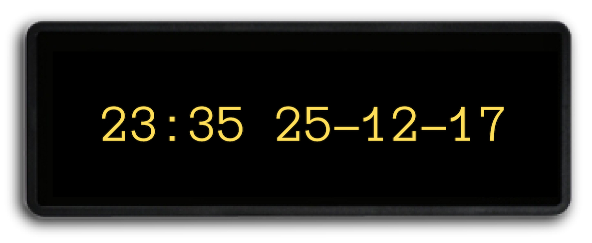

## 0145 - Programando una clase para almacenar fechas y horas

1. Toma nota de a qué hora comienzas la actividad. Además recuerda utilizar:
   * Nombres descriptivos para atributos, variables, métodos y parámetros.
   * Textos breves y descriptivos para los mensajes de los commits.
   * Un solo `return` en cada método.

2. Crea un nuevo proyecto en BlueJ e inicializa un repositorio git en él. Incluye el archivo `.gitignore`.

3. Crea tu repositorio remoto en GitHub siguiendo este link: https://classroom.github.com/a/qeVXzp7A

3. Se pide que implementes una clase llamada `PantallaHoraYFecha` teniendo en cuenta que:

    * La clase debe permitir crear objetos `PantallaHoraYFecha` a través de un constructor sin parámetros. Este objeto almacenará la fecha 1 de enero del año 1 a las 00:00.
    * La clase debe permitir obtener, a través de un método sin parámetros llamado `getFechaYHora`, un `String` de 14 caracteres que contenga la fecha y la hora del tipo: `"08:35 07-11-17"`.
    * La clase debe permitir avanzar un minuto la fecha y hora almacenadas a través de un método sin parámetros llamado `avanzarMinuto`. Hemos de tener en cuenta que para nosotros los meses tienen todos 30 días y que solo vamos a contemplar los años del 1 al 99.
    * La clase debe permitir fijar una fecha y hora a través de un método llamado `fijarFechaYHora` que requiere de 5 parámetros enteros (qe se corresponden con la hora, los minutos, el dia, el mes y el año). Asumimos que los parámetros que nos van a pasar tienen valores legales.
    * Para realizar la actividad debes basarte en la clase `PantallaDosDigitos` disponible en el repsositorio `pro-pantalla-reloj`.
    * Haz un commit por cada método que completes.

#### Entrega

* Entrega la URL del último commit de tu repositorio. __Atención__: 
  * Es obligatorio que __el último commit existente compile__. En caso contrario no se evaluará la práctica.
  * Es obligatorio entregar __la URL del último commit__. Pregunta al profesor para asegurarte de que envías la URL correcta. En caso contrario no se evaluará la práctica. 
  
* El enlace a un vídeo grabado por ti subido a Youtube donde demuestres que tu clase funciona correctamente, especialmente en los casos más limites (cambios de hora, día, mes y año).

* Entrega una captura de pantalla de Github donde se vea el listado de commits de tu proyecto.

* Entrega también un comentario público y una copia de ese comentario como comentario privado en la actividad de Google Classroom donde indiques:
    - El tiempo que has tardado en completar la actividad.
    - El grado de dificultad que has apreciado.
    - Dónde has cometido un error al hacer la actividad y cómo lo has solucionado. **Aportar este dato es obligatorio para que esta actividad cuente como hecha.**
    

