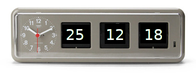

## 0321 - Programando la primera clase entera: un calendario

1. Toma nota de a qué hora comienzas la actividad. Además recuerda utilizar:
   * Nombres descriptivos para métodos y parámetros.
   * Textos breves y descriptivos para los mensajes de los commits.
   
2. Crea un repositorio remoto siguendo este enlace: https://classroom.github.com/a/el3LGDOx. Copia las instrucciones para enlazar el futuro repositorio local que vas a crear más adelante con este repositorio remoto que acabas de crear.

2. Abre BlueJ y asegúrate de que no hay ningún proyecto abierto. 

3. Descarga el archivo jar del siguiente enlace: https://github.com/miguelbayon/basic-calendar-jar.

4. Mediante la opción _Proyect_ - _Open ZIP/JAR_ de BlueJ, abre el archivo que has descargado. Aparecerá en pantalla la clase `CalendarioBasico`. Investiga su funcionamiento interactuando con ella hasta que descubras todas las caracteristicas de los objetos de tipo `CalendarioBasico`.

2. Abre una nueva ventana de BlueJ, crea un nuevo proyecto y crea una clase llamada `CalendarioBasico` vacía.

4. En la carpeta donde esté tu nuevo proyecto crea un repositorio de git, haz un commit y enlázalo con el repositorio remoto creado en el paso 2.

3. Codifica el código necesario en la clase `CalendarioBasico` para que los objetos de esta clase sean capaces de guardar internamente una fecha usando __3 atributos enteros__ y sean capaces de devolver dicha fecha como una cadena de caracteres. En concreto, tu clase `CalendarioBasico` debe ser una clase que:

    * Permita la construcción de objetos sin parámetros. Un objeto recién construido de la clase `CalendarioBasico` almacena la fecha `01-01-01`. El año se debe almacenar únicamente con los dos últimos dígitos: `16` en caso del `2016` o `7` en caso del `2007`, dado que solo vamos a contemplar años desde el 2000 hasta el 2099.

    * Permita, a través de un método, fijar la fecha que va a almacenar el calendario indicando por parámetro el día, el mes y el año de dicha fecha. Estos parámetros deberán ser parámetros enteros. No es necesario comprobar que los parámetros tengan valores legales, damos por hecho que tienen valores válidos cuando nos los indican.

    * Permita, a través de un método, avanzar en un día la fecha almacenada. El método deberá de preocuparse de que la nueva fecha del objeto sea una fecha legal teniendo en cuenta que:

         * No vamos a preocuparnos por los años bisiestos.
  
         * Todos los meses van a tener para nosotros 30 días.  

    * Tenga un método que devuelva una __cadena de 8 caracteres__ consistente en el día, el mes y el año separados por un guión.

6. Vete haciendo commits conforme le añades funcionalidad a tu clase y súbelo a tu repositorio remoto de GitHub.

#### Entrega

* Entrega la URL de tu repositorio.
* El enlace al vídeo grabado subido a Youtube. Se valorará que en la demo demuestres que tu clase funciona en los casos más limites (cambios de mes, cambios de año, etc.).
* Entrega una captura de pantalla de Github donde se vea el listado de commits de tu proyecto.
* Entrega también un comentario público y una copia de ese comentario como comentario privado en la actividad de Google Classroom donde indiques:
    - El tiempo que has tardado en completar la actividad.
    - El grado de dificultad que has apreciado.
    - Dónde has cometido un error al hacer la actividad y cómo lo has solucionado. **Aportar este dato es obligatorio para que esta actividad cuente como hecha.**
