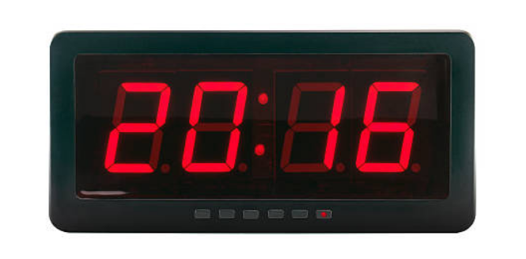

## 0568 - Construyendo una aplicacion para un reloj



Hasta el momento hemos examinado qué son los objetos y cómo se implementan. En concreto, hemos hablado de los atributos, los constructores y los métodos al examinar las definiciones de clases.

Ahora vamos a dar un paso más allá. Para construir aplicaciones interesantes no basta con construir objetos que funcionen de manera individual. Deben combinarse los objetos con el fin de que pueda cooperar y llevar a cabo una tarea común. A continuación vamos a construir una pequeña aplicación a partir de tres objetos y vamos a ver cómo actuar para que unos métodos invoquen a otros para conseguir sus objetivos.

El proyecto que utilizaremos para hablar de la interacción entre objetos será una pantalla para un reloj digital. La pantalla muestra las horas y los minutos separados por un carácter de dos puntos en formato de visualización de 24 horas al estilo europeo. Por tanto, la pantalla mostrará la hora desde las 00:00 (medianoche) hasta las 23:59 (un minuto antes de medianoche). 

## Abstracción y modularización

Una primera idea podría ser implementar toda la pantalla del reloj mediante una única clase. Eso es, después de todo, lo que hemos visto hasta ahora: cómo construir clases para llevar a cabo una determinada tarea.

Sin embargo enfocaremos el problema de forma ligeramente distinta. Veremos si podemos identificar subcomponentes en el problema que podamos transformar en clases separadas. La razón principal para actuar así es la _complejidad_. A medida que avancemos en el curso, los ejemplos que utilicemos y los programas que construiremos serán cada vez más complejos. Tareas triviales como la de la máquina expendedora pueden resolverse como un único problema: examinamos la tarea completa y desarrollamos una solución con una única clase. Sin embargo, para problemas más complejos este enfoque es demasiado simple. A medida que la complejidad de un problema aumenta, cada vez se hace más difícil controlar todos los detalles simultáneamente.

La solución que usaremos para tratar con el problema de la complejidad es la _abstracción_. Dividiremos el problema en una serie de subproblemas, que a su vez dividiremos en sub-subproblemas,  y así sucesivamente hasta que cada problema individual es suficientemente pequeño para poder resolverlo de manera sencilla. Una vez resuelto uno de los subproblemas, ya no dedicaremos más tiempo a pensar en los detalles de esa pequeña parte, sino que trataremos la solución a ese subproblema como si fuera un único bloque componente que podemos emplear para solucionar el problema más grande en el que está englobado. Esta técnica se denomina _divide y vencerás_.

Expliquemos este enfoque con un ejemplo. Imagina a dos ingenieros de una empresa de la industria automovilística diseñando un nuevo vehículo. Pueden pensar en las distintas características del vehículo, como la forma de la carrocería, el tamaño y la ubicación del motor, el número y el tamaño de los asientos en el interior del coche, la separación exacta de las ruedas, etc. Por su parte, otro ingeniero cuyo trabajo sea diseñar el motor (bueno, en realidad, de eso  se encarga un equipo de ingenieros, pero simplificaremos un poco las cosas para aclarar el ejemplo) se dedica a pensar en las distintas partes que tiene un motor: los cilindros, el mecanismo de inyección, el carburador, la electrónica, etc.  Pensará en el motor no como si fuera una única entidad, sino como una obra compleja compuesta por múltiples partes. Una de esas partes podría ser una bujía.

Por tanto, habrá un ingeniero (quizá en una empresa distinta)  que diseñe las bujías. Ese ingeniero pensará en una bujía como si fuera un artefacto complejo, formado por múltiples partes. Es posible que haya realizado complejos estudios para determinar exactamente el tipo de metal a utilizar para los contactos o qué clase de material y de proceso de producción emplear para el aislamiento.

Lo mismo vale para muchas otras partes del vehículo. Un diseñador en el nivel más alto considerará una rueda como si fuera un único componente. Otro ingeniero situado mucho más abajo en la cadena de producción podría dedicar su tiempo de trabajo a pensar en la composición química necesaria para obtener los materiales correctos con los que fabrican las llantas. Para este último ingeniero, la llanta es algo muy complejo, mientras que para la empresa de automóviles que se limita a comprar las llantas ya hechas a la empresa que las vende cada llanta es una única entidad simple. Esto es lo que se llama abstracción.

El ingeniero de la empresa que compra las llantas ya hechas se abstrae de los detalles de la fabricación de la llanta, para poder concentrarse en los detalles de la construcción por, ejemplo, de la rueda completa. El diseñador del coche que piensa en la forma del chasis del vehículo se abstrae de los detalles técnicos de las ruedas y del motor, para concentrarse en el diseño del chasis (lo único que le interesa saber es cómo encajan las ruedas y el motor, pero nada más de su complejidad interna).

Sucede lo mismo para cualquier otro componente. Mientras que alguien puede estar preocupado por diseñar el espacio interior del vehículo donde se alojan los pasajeros, alguna otra persona puede estar trabajando en desarrollar el tejido que terminará por utilizarse para cubrir los asientos.

Lo importante es que, si se contempla con el suficiente detalle, un vehículo está compuesto por tantas partes distintas que es imposible que una única persona conozca todos los detalles de esas partes al mismo tiempo. Si fuera necesario que alguien conociera todos los detalles, jamás podríamos llegar a construir ni un solo vehículo.

La razón por la que podemos llegar a construir vehículos es que los ingenieros utilizan la modularización y la abstraccion. Dividen en el vehículo en módulos independientes (ruedas, motor, caja de cambios, asientos, volante) y encargan a otos ingenieros que trabajen en los distintos módulos de forma independiente. Una vez construido un módulo, utilizan la abstracción:  contemplan dicho módulo como un único componente que se emplea para construir componentes más complejos.

Por tanto, la modularización y la abstracción se complementan entre sí. La modularización es el proceso de dividir grandes cosas (problemas) en partes más pequeñas, mientras que la abstracción es la capacidad de ignorar los detalles de las partes pequeñas para centrarse en la panorámica general.

## Abstracción en el software

En el desarrollo de software se emplean los mismos principios de modularización y abstracción de los que hemos hablado en la sección anterior. Para ayudarnos a mantener una visión panorámica en los problemas más complejos, tratamos de identificar subcomponentes que podamos programar como entidades independientes. Después, intentamos usar esos subcomponentes como si fueran partes simples, sin preocuparnos acerca de su complejidad interna.

En la programación orientada a objetos, estos componentes y subcomponentes son precisamente objetos. Si estuviéramos tratando de construir un vehículo en programación, con un lenguaje orientado a objetos, trataríamos de hacer lo que hacen los ingenieros de diseño de vehículos. En lugar de implementar el automóvil como un único objeto monolítico, construiríamos primero objetos separados para el motor, la caja de cambios, las ruedas, los aisentos, etc. y luego ensamblaríamos el objeto vehículo a partir de esos objetos más pequeños.

Identificar qué tipo de objetos (y por tanto qué tipo de clases) hay que incluir en una aplicación para cualquier problema dado no siempre es fácil, y tendremos que hablar extensamente sobre ello más adelante. Por ahora comenzaremos con un ejemplo relativamente simple y dirigiremos nuestra atención a reloj digital comentado anteriormente.

## Modularización en el ejemplo del reloj

Echemos un vistazo más detallado al ejemplo de la pantalla del reloj. Utilizando los conceptos de abstracción que acabamos de describir, queremos encontrar la mejor forma de contemplar este ejemplo para poder escribir algunas clases que lo implementen. Una forma de contemplarlo consiste en considerarlo compuesto por una única pantalla con cuatro dígitos (dos para las horas y otras dos para los minutos). Si ahora nos abstraemos de esa visión de muy bajo nivel, podemos ver que el reloh también podría contemplarse como formado por dos pantallas separadas de dos dígitos cada una (una pantalla para las horas y otra para los minutos).

Una de las parejas comienza en 0, se incrementa en 1 cada hora y vuelve a cero después de alcanzar su límite de 23.  La otra pareja vuelve a cero después de alcanzar su límite de 59. La similitud en el comportamiento de estas dos pantallas podría llevarnos a abstraernos aún más, evitando contemplar de manera distinta la pantalla de las horas y la de los minutos. En lugar de ello, podríamos pensar en esas dos pantallas como objetos capaces de mostrar valores que van desde un valor inicial (en este caso 0) a un determinado límite. El valor almacenado puede incrementarse, pero si se alcanza el límite vuelve al valor inicial. Con esto parece que hemos alcanzado un nivel apropiado de abstracción, que podemos representar mediante una clase:  una clase para una pantalla de 2 dígitos. 

Para resolver el problema del reloj, primero programaremos una clase que representa una pantalla numérica de 2 dígitos. Dotaremos a esta clase de un método selector para consultar su valor y de dos métodos mutadores para fijar el valor y para incrementarlo. Una vez definida esta clase, podremos simplemente crear dos objetos de esa clase con diferentes límites para poder construir la pantalla completa del reloj.

## Implementación de la pantalla del reloj

Como hemos dicho, para construir la pantalla del reloj, primero crearemos una pantalla numérica de 2 dígitos. Esta pantalla necesita almacenar tres valores:
1. El límite hasta el que puede contar la pantalla.
2. El valor inicial donde arranca la pantalla.
3. El valor actual que tiene almacenado y muestra la pantalla. 

Representaremos estos valores como campos enteros en nuestra clase:

```java
public class PantallaDosDigitos {
 // El valor inicial de la pantalla
private int valorInicial;
// El valor limite que nunca alcanza la pantalla. Al llegar a el, el valor almacenado vuelve a tomar el valor inicial,
private int valorLimite;
// El valor actual que tiene almacenado la pantalla
private int valorAlmacenado;

//Se omiten el constructor y los métodos
}
```

Si llegados a este punto nos olvidamos de los detalles internos de esta clase `PantallaDosDigitos` y reflexionamos algo más sobre la pantalla completa de reloj, podemos llegar a la conclusión de que para construir la pantalla completa del reloj necesitaremos de dos pantallas numéricas de 2 dígitos (una para las horas y otra para los minutos). 

Por tanto, en la clase general `PantallaReloj` necesitaremos de dos atributos de la clase `PantallaDosCaracteres` de la siguiente manera:

```java
public class PantallaReloj {
	//La pantalla de las horas
	private PantallaDosDigitos pantallaHoras;
	//La pantalla de los minutos
	private PantallaDosDigitos pantallaMinutos;
}
```

Lo que vemos en este último código es una novedad: un nombre de una de nuestras clases puede utilizarse como tipo de una variable. Estas variables que tienen como tipo una clase de de nuestro programa pueden almacenar objetos de dicha clase. Decimos que _las cases definen tipos_.

Si recuerdas dijimos que para definir los atributos utilizábamos primero la palabra `private` seguida de un tipo y del nombre del atributo. En este caso hemos utilizado como tipo la clase `PantallaDosDigitos` por lo que se demuestra que las clases pueden ser utlizadas como tipos.

El tipo de un atributo específica qué especie de datos pueden almacenarse en ese atributo. Si el tipo es una clase,  el atributo podrá contener objetos de dicha clase.  La declaración de un atributo o de otra variable cuyo tipo es una clase no crea automáticamente un objeto de esa clase. Al contrario, el atributo estará inicialmente vacío, por lo que seremos nosotros quien tendremos que crear explícitamente los objetos que queremos se almacenen en estos atributos.

## Diagrama de objetos y diagrama de clases

La estructura descrita hasta el momento puede visualizarse mediante un _diagrama de objetos_ como el que se muestra a continuación en este diagrama vemos que estamos tratando con tres objetos:


A continuación se muestra el _diagrama de clases_:


Observa que el diagrama de clases solo muestra dos clases, mientras que en el diagrama de objetos aparecen tres objetos distintos. Esto tiene que ver con el hecho de que se pueden crear varios objetos a partir de una misma clase. En este caso tenemos dos objetos de la clase `PantallaDosDigitos`.

Estos dos diagramas ofrecen visiones distintas de la misma aplicación. el legado de clases muestra la vista estática. En él se refleja qué relaciones tenemos a nivel de clases si miramos el código fuente de nuestro programa. Tenemos dos clases y la flecha indica que la clase `PantallaReloj` hace uso de la clase `PantallaDosDigitos`. En efecto, hace uso porque los atributos de la clase `PantallaReloj` son de la clase `PantallaDosDigitos`. Decimos que la clase `PantallaReloj` depende de la clase `PantallaDosDigitos`.

Cuando nuestro programa comience crearemos un objeto de la clase `PantallaReloj`. La clave es que en el constructor de esa clase nos ocupemos de crear los dos objetos `PantallaDosDigitos` que necesitamos para los dos atributos de esa clase. Por tanto, el diagrama de objetos muestra la situación a nivel de objeto en tiempo de ejecución, es decir, en el momento en que se está ejecutando la aplicación. Decimos que el diagrama de objetos muestra la vista dinámica de la aplicación.

El diagrama de objetos también muestra otro detalle muy importante: cuando una variable almacena un objeto, el objeto no se almacena directamente dentro de la variable, sino que la variable contiene una _referencia a objeto_ (la flecha). El objeto al que hace referencia a la variable está almacenado fuera del objeto en el que aparece la referencia, y es precisamente esa referencia a objeto lo que enlaza los dos objetos entre sí. 

Es muy importante comprender estos dos diagramas distintos, que representan dos visiones diferentes de la aplicación. BlueJ nos proporciona la vista estática en la parte superior, en el lugar donde se muestran las clases. No obstante, para planificar y comprender programas Java más complejos, hemos de ser capaces de construir diagramas de objetos sobre papel o en nuestra cabeza. Cuándo pensemos en lo que va a hacer nuestro programa, pensaremos en las estructuras de objetos que creará y en como interaccionarán esos objetos. Es esencial saber visualizar las estructuras de objetos.

En resumen, el diagrama de clases muestra las clases de una aplicación y las relaciones entre ellas. Proporciona información acerca del código fuente y presenta una vista estática del programa.

Por su parte, el diagrama de objetos muestra los objetos y sus relaciones en un instante determinado durante la ejecución de la aplicación. Proporciona información acerca de los objetos en tiempo de ejecución y presenta una vista dinámica del programa.

## Tipos primitivos y tipos referenciados

Java trabajar con dos especies muy distintas de tipos:  por un lado tenemos los _tipos primitivos_ y por otro los _tipos referenciados_. 

Los tipos primitivos están todos ellos predefinidos en el lenguaje Java. Entre ellos se incluyen `int`, `double`, `float`, `long` , `char` o `boolean`. En cambio, los tipos referenciados son aquellos que están definidos mediante clases. Algunas de estas clases ya vienen con Java (como, por ejemplo, la clase `String`) y otras las escribimos nosotros.

Tanto los tipos primitivos como los tipos referenciados pueden emplearse como tipos, pero hay situaciones en las que se comportan de manera diferente.  una de ellas afecta al modo en el que se almacenan los valores. Como hemos podido ver en nuestros diagramas, los valores primitivos se almacenan directamente dentro de la variable; por el contrario, los objetos no se almacenan directamente en la variable, sino que lo que se almacena es una referencia al objeto (dibujada como una flecha en nuestros diagramas).

## Análisis de la clase `PantallaDosDigitos`

Aunque la clase `PantallaDosDigitos` es bastante sencilla, ilustra algunas características nuevas de Java.  La clase está compuesta por tres atributos de los que hemos hablado anteriormente, un constructor y cuatro métodos. 

Clona el respoitorio `pro-pantalla-dos-digitos` y ábrelo en BlueJ. Selecciona _Show terminal_ en el menú _View_ y activa la opción `Record method calls`. Así podrás ver el resultado de tus interacciones con los objetos. Crea ahora un objeto de la clase `PantallaDosDigitos` (poniéndole como nombre `minutos` en lugar del que por defecto te propone BlueJ). Indica como valor de inicio 0 y como valor límite 60. Una vez creado, inspecciona el objeto y, con el inspector abierto en pantalla, invoca el método `incrementaValorAlmacenado`. Observa lo que aparece en la terminal de BlueJ. Invoca varias veces más  el método `incrementaValorAlmacenado` para comprobar como, en efecto, el valor almacenado se va incrementando.

Crea ahora un segundo objeto de la clase `PantallaDosDigitos` con un valor inicial de 0, un límite de 24 y llama a este objeto `horas`.Date cuenta que tú estás asumiendo, haciendo clics en BlueJ,  el papel que asumirá la clase general `PantallaReloj`: has creado a base de clics los dos objetos de la clase `PantallaDosDigitos` y tienes el control de ambos objetos.

Piensa ahora detenidamente: si sigues invocando el método  `incrementaValorAlmacenado` sobre el objeto `minutos`, ¿en qué momento deberías de preocuparte de invocar el método `incrementaValorAlmacenado` sobre el objeto `horas`?

Cierra el proyecto y vuelve a abrirlo. Selecciona _Show Code Pad_ en el menú _View_ y ejecuta dentro del CodePad la siguiente instrucción:

```java
PantallaDosDigitos pantalla = new PantallaDosDigitos(0, 6);
```

Invoca a través de CodePad los métodos `getValorAlmacenado`, `setValorAlmacenado` (con el valor de parámetro que desees) e `incrementaValorAlmacenado`. Observa que los métodos que cambian el objeto (métodos mutadores) necesitan para su ejecución en el CodePad de un punto y coma al final, mientras que los métodos selectores no.

Ejecuta la siguiente línea:

```java
PantallaDosDigitos.getValorAlmacenado()
```

Analiza detenidamente el mensaje de error que aparece e intenta recordarlo Ya que es muy probable que en el futuro te topes con alguno similar. Observa que el error ha consistido en intentar invocar método sobre el nombre de la clase en lugar de invocador sobre la variable `pantalla` que habíamos declarado e inicializado antes.

Ejecuta la siguiente línea:

```java
pantalla.setValorAlmacenado(int 5);
```

En esta ocasión el mensaje de error no nos ayuda a saber dónde está el error, pero si te fijas verás que lo que ocurre es que estamos invocando un método que requiere de un parámetro usando dos palabras (`int 5`). Este error se comete con muchísima frecuencia al empezar a programar. Recuerda que cuando estamos creando el código fuente de una clase y _estamos escribiendo la cabecera_ de un método entonces utilizamos dos palabras para cada parámetro; en cambio, si lo que estamos es invocando un método sobre un objeto, entonces solo utilizamos una.

Vamos a continuar ahora el análisis del código de la clase. El constructor de la clase `PantallaDosDigitos` recibe dos parámetros: el valor inicial de la pantalla y el valor límite de la misma. Por ejemplo si definimos como valor inicial 0 y valor límite 24, la pantalla nunca mostrará este último valor: cuando incrementemos el valor estando en 23, este volverá a 0. (Este modo de funcionamiento va a ser el que nos permita utilizar esta clase tanto para mostrar las horas como para mostrar los minutos).

A continuación sigue un método getter simple que obtiene el valor almacenado actualmente (`getValorAlmacenado`).

El siguiente método `setValorAlmacenado`  es más interesante, porque intenta garantizar que el valor almacenado en un objeto `PantallaDosDigitos` sea siempre válido. A este método se le pasa como parámetro el nuevo valor que ha de almacenar la pantalla y el método se ocupa, antes de almacenarlo, de comprobar que es un valor legal. El rango legal para el valor, como hemos dicho antes, va desde el valor inicial de la pantalla (incluido) hasta el valor límite de la pantalla (excluido). Para fijar el valor solo si es válido nos valemos de una instrucción `if`. En la condición booleana del ´if´ vemos un operador nuevo: `&&`. Este operador se denomina _”and lógico”_ o _”y lógico”_ y hace que la condición de la instrucción ´if´ sea cierta si las dos condiciones a ambos lados del símbolo `&& ` son ciertas; en caso contrario la condición es falsa.

El operador `&&` es uno de los operadores lógicos con los que cuenta Java. Los operadores lógicos actúan sobre valores booleanos (`true` o `false`) y producen un nuevo valor booleando como resultado. Los tres operadores lógicos más importantes son `and`, `or` y `not`. En Java se escriben de la siguiente forma:

```java
&& (and)
|| (or)
! (not)
```

La expresión: 

```java
a && b
```

es verdadera si tanto `a` como `b` son verdaderas y falsa en todos los casos restantes. La expresion: 

```java
a || b
```

es verdadera si `a` o `b` son verdaderas y solo es falsa si `a` y `b` son falsas a la vez. Finalmente, la expresión:

```java
!a
```

es verdadera si `a` es falsa y será falsa si `a` es verdadera.

El siguiente método `getTextoDeLaPantalla` también devuelve  el valor de la pantalla, pero es un  formato distinto. La razón es que queremos visualizar el valor en forma de cadena de dos dígitos. Es decir, si la hora actual es la 3:05,  creemos que la pantalla muestra ‘’03:05` y no `3:5`.  Para hacerlo fácilmente, hemos implementado el método `getTextoDeLaPantalla`.  Este método devuelve el valor actual en forma de cadena de caracteres y añade un cero al principio si el valor es menor que 10.  He aquí la sección de código relevante: 

```java
String valorADevolver = valorAlmacenado + "";
if(valorAlmacenado < 10) {
valorADevolver = "0" + valorAlmacenado;
}
return valorADevolver;
```

Observa que el cero (`”0”`) está escrito entre dobles comillas. De ese modo hemos escrito la cadena de caracteres (`String`) 0, y no el número entero (`ìnt`) 0. Por tanto, la expresión:

```java
“0” + valorAlmacenado

está sumando una cadena de caracteres y un entero ( porque el tipo de `valorAlmacenado`  es un número entero). El operador de suma representa otra vez, por tanto, una concatenacion de cadenas, como hemos visto anteriormente. Antes de continuar, vamos a examinar más en detalle la concatenacion de cadenas de caracteres.

Emperador suma (`+`) tiene diferentes significados según el tipo de sus operandos. Si los dos operandos son números, representa la suma algebraica como cabría esperar. Por tanto:

```java
42 + 12
```

Suma los números 42 y 12 dando como resultado 54. Sin embargo, si los operando son cadenas de caracteres entonces el significado de signo `+` es la concatenacion de cadenas, y el resultado es una única cadena de caracteres compuesta por ambos operandos uno a continuación del otro. Por ejemplo, el resultado de la expresión:

```java
“Aprender Java” + “es facil”
```

sería la cadena de caracteres:

```java
“Aprender Javaes fácil”

Observa que la concatenacion de cadenas no añade automáticamente un espacio entre las cadenas. Si queremos un espacio, tenemos que incluirlo nosotros mismos en una de las dos cadenas.

Sí uno de los operandos de una operación suma es una cadena y el otro no, entonces automáticamente se convierte el otro operando a una cadena, para realizar después una concatenacion. Por tanto:

```java
“respuesta: ” + 42
```

da como resultado la cadena:

```java
“respuesta: 42”
```

Esto funciona para todos los tipos. Con independencia del tipo que se sume a una cadena, dicho tipo se convertirá automáticamente a una cadena y luego se concatenará.

Volvamos a nuestro código del método `getTextoDeLaPantalla`. Por ejemplo, si `valorAlmacenado` contiene 3, entonces la instrucción:

```java
valorADevolver =  “0” + valorAlmacenado
```

asignará la cadena `”03”` a la variable local `valorADevolver`. En caso de que el valor no sea inferior a 10, utilizamos el truco:

```java
String valorADevolver = valorAlmacenado + "";
```

Aquí con que tenemos `valorAlmacenado` con una cadena vacía. El resultado es que el valor se convertirá en una cadena y no se le añadirá ninguno otro carácter. En esta ocasión nos estamos valiendo del operador suma con el único propósito de forzar la conversión del valor entero en un valor de tipo `String`.

El último método de la clase `PantallaDosDigitos` incrementa el valor de la pantalla en 1. El método se preocupa de devolver el valor a cero cuando se alcanza el límite:

```java
public void incrementaValorAlmacenado() {
int valorIncrementado = valorAlmacenado + 1;
int tamanoIntervalo = valorLimite - valorInicial;
valorAlmacenado = (valorIncrementado % tamanoIntervalo) + valorInicial;
}
```

Este método utiliza el operador módulo (`%`). El operador módulo calcula el resto de la división entera. Por ejemplo, el resultado de la división:

```java
27 / 4
```

se puede expresar mediante números enteros como:

```
resultado = 6, resto 3
```

El operador módulo devuelve simplemente el resto de dicha división. Por tanto, el resultado de la expresión `(27 % 4)` sería `3`.

Para entender cómo funcionan cálculos parecidos a los del método `incrementaValorAlmacenado` a veces resulta útil pensar en un supuesto caso y hacer una tabla como la siguiente:

```
valorInicial = 3
valorLimite = 10

tamanoIntervalo = 7

valorAlmacenado  valorIncrementado  valorIncrementadoReajustado  valorIncrementadoEnElIntervalo  valorAlmacenadoFinal
      3                   4                      1                             1                           4
      4                   5                      2                             2                           5
      5                   6                      3                             3                           6
      6                   7                      4                             4                           7
      7                   8                      5                             5                           8
      8                   9                      6                             6                           9
      9                  10                      7                             0                           3
```

En este caso hemos dado por supuesto que el `valorInicial` sería 3, el `valorLimite` sería 10 y hemos probado todos los posibles casos para asegurarnos de que nuestros cálculos ofrecen el resultado que esperamos.

## Revisión de la clase `PantallaReloj`

Ahora que hemos visto como definir una clase Qué define una pantalla numérica de 2 dígitos, examinaremos con más detalle la clase `PantallaReloj` que permite crear dos pantallas numéricas de dos dígitos con el fin de crear una pantalla completa de reloj de cuatro dígitos.

Clona el repositorio `pro-pantalla-reloj` y ábrelo con BlueJ. Lee el comentario que existe antes del inicio de código en la clase `PantallaReloj`. Esta clase quiere simular un software que se ejecuta sobre un reloj real que le envía pulsos a cada minutos.

Crea un objeto `PantallaReloj` seleccionando el constructor sin parámetros e invoca el método `getTextoDeLaPantalla` para obtener la hora inicial con la que se ha configurado el reloj. Debería devolver el valor `”00:00”` ya que en ese constructor las horas y los minutos se configuran inicialmente a 0.

Ahora abre el inspector de objetos sobre el objeto creado y, con el inspector abierto, invoca sucesivamente el método `pulso` y el método `getTextoDeLaPantalla` y verifica que el comportamiento es el esperado. 

En principio deberías de ejecutar este par de métodos para conseguir que la hora avance a `01:00` pero hay otra posibilidad: utiliza el método `setTiempo` para fijar la hora `00:59` e invoca el método `pulso` a continuación para comprobar que el paso a las `01:00` se produce correctamente.

Si analizas el código fuente de la clase verás que dispone de dos atributos de tipo `PantallaDosDigitos` llamados `pantallaHoras` y `pantallaMinutos`. Cada uno de estos atributos puede almacenar un objeto de la clase `PantallaDosDigitos` (o más concretamente, una referencia a un objeto de la clase `PantallaDosDigitos`).

La primera pregunta que nos hacemos es de dónde vienen los objetos `PantallaDosDigitos` que utiliza `PantallaReloj` . Cuando creamos un objeto de la clase `PantallaReloj` asumimos que tiene dos objetos internos de este tipo. Pero para que esto suceda, hemos de encargarnos de que en el código del constructor de la clase `PantallaReloj` (o de los consctructores, más exactamente) se creen explícitamente estos dos objetos. Es por ello que verás en ambos constructores dos líneas con el operador `new`:

```java
pantallaHoras = new PantallaDosDigitos(0, 24);
pantallaMinutos = new PantallaDosDigitos(0, 60);
```

Cada instrucción de las anteriores hace tres cosas:
1. Crea un nuevo objeto de la clase `PantallaDosDigitos`.
2. Ejecutar el constructor de la clase `PantallaDosDigitos`.
3. Asigna una referencia al objeto creado de la clase `PantallaDosDigitos` al atributo indicando antes del `=`.

Con esto la pantalla del reloj estará lista para funcionar. Date cuenta que desde el punto de vista de una persona que solo esté interactuando con BlueJ, cuando crea un objeto de tipo `PantallaReloj` no percibe que, a continuación e internamente, se están creando dos objetos de la clase `PantallaDosDigitos`.

Si te has fijado al crear el objeto `PantallaReloj` te habrás dado cuenta de que el menú emergente ofrece dos alternativas:

```java
 public PantallaReloj() 
public PantallaReloj(int horas, int minutos) 
```

Esto se debe a que la clase `PantallaReloj` contiene dos constructores. Lo que esos dos constructores proporcionan son dos formas alternativas de inicializar un objeto de la clase `PantallaReloj`. Si se utiliza el constructor que no tiene parámetros, entonces la hora inicial mostrada en el reloj será `00:00`. Por otro lado, si queremos tener una hora inicial distinta, podemos configurar la con la ayuda del segundo constructor. Es común que las definiciones de clases contengan varios  constructores (o varios métodos con el mismo nombre) que se diferencian entre si solo por el conjunto de parámetros que reciben. Esto se conoce con el nombre de _sobrecarga_ de un constructor (o _sobrecarga_ de un método).

La última línea del segundo constructor consta de la instrucción:

```java
setTiempo(horas, minutos);
```

Esta última instrucción es una _llamada a método_. La clase `PantallaReloj` tiene un método con la siguiente cabecera:

```java
public void setTiempo(int horas, int minutos)
```

Lo que hace esa llamada a método es invocar precisamente este método. Dado que este método se encuentra definido dentro de la misma clase en la que se produce la llamada al método, decimos que se trata de una _llamada a metodo interna_. Las llamadas a métodos internas se caracaterizan porque no tiene nombre de variable y punto delante de la invocación. En este caso no se necesita poner la variable y el punto ya que en una llamada a método interno el objeto que realiza la invocación está invocando un método sobre sí mismo. 

Cuando Java se encuentra delante de una llamada a método interno ejecuta el correspondiente método y, luego, hace que la ejecución vuelva a la siguiente línea a donde se produjo la invocación al método interno (en este caso corresponde con el final del constructor). 

Examina ahora el método `pulso`. Si la pantalla del reloj estuviera conectada a un reloj real, este método sería invocado una vez cada 60 segundos por el temporizador de cuarzo (o por el temporizador electrónico) del reloj. Por el momento, nosotros vamos a invocarlo manualnente con el fin de probar que la pantalla del reloj funciona correctamente.

Cuando se invoca el método `pulso`, primerp se ejecuta la instrucción que hace avanzar la pantalla de los minutos:

```java
pantallaMinutos.incrementaValorAlmacenado();
```

Está instrucción llama al método `incrementaValorAlmacenado` del atributo `pantallaMinutos`. Por tanto, estamos ante una situación en la que hemos invocado un método de la clase `PantallaReloj` (concretamente `pulso`) y este, a su vez, invoca un método de otro objeto para llevar a cabo parte de su tarea. Las llamadas a métodos de otros objetos como estas dentro de una clase se denominan _llamadas a método externos_. En este caso sí hace falta indica delante del punto el nombre de la variable sobre la que invocas el método. Esta notación se conoce como _notación con punto_. 

Es muy importante darse cuenta que cuando hacemos una llamada a método externo debemos utilizar el nombre de un objeto de una clase y no el nombre de la clase. En este caso empleamos `pantallaMinutos.` en lugar de `PantallaDosDigitos.` (que sería incorrecto).

La diferencia entre llamadas a métodos internos y externos está clara;  la presencia de un nombre seguido por un punto nos informa de que el método invocado forma parte de otro objeto. Así, en el método `pulso`,  el objeto `PantallaReloj`  llama a métodos de los objetos `PantallaDosDigitos`  para que se ocupen de parte de la tarea global.  Dicho de otro modo, la responsabilidad de la tarea general de registro del tiempo se divide entre la clase `PantallaReloj` y la clase `PantallaDosDigitos`. Se trata de un ejemplo práctico del principio de _divide y vencerás_ del que hablamos anteriormente.

El mercado `pulso` tiene a continuación una instrucción `if`  para comprobar si también es necesario incrementar las horas. Como parte de la condición de la instrucción `if`, invoca otro método del objeto `pantallaHoras`: el método `getValorAlmacenado`. Este método devuelve el valor actual de los minutos en formato numérico. Si valor es cero, entonces sabremos que la pantalla acaba de volver a cero y que debemos incrementar también las horas. Esto es exactamente lo que hace el código.

Sí el valor de los minutos no es cero, entonces habremos terminado.  No necesitamos cambiar las horas en este caso. Por tanto, la instrucción `if` no necesita de una parte `else`.

Con esto deberíamos de comprender los métodos restantes de la clase `PantallaReloj`. El método `setTiempo``admite dos parámetros (la hora y los minutos) y configura el reloj con los valores especificados. Examinando el cuerpo del método podemos ver que hace esto invocando los métodos `setValorAlmacenado` de ambas pantallas (la de las horas y la de los minutos).

El método `getTextoDeLaPantalla` es trivial y su labor es devolver la cadena de visualización actual del reloj. Puesto que las dos pantallas numéricas de las que se compone el reloj son capaces por sí mismas de devolver sus valores en formato de dos dígitos, lo único que tenemos que hacer en este caso es concatenar ambos valores.

Merece la pena deternernos finalmente a examinar la forma en que se utiliza la abstracción en este proyecto con el fin de dividir el problema en partes más pequeñas. Examinando el código fuente de la clase `PantallaReloj`  podemos observar que nos limitamos a crear dos objetos de la clase `PantallaDosDigitos`  sin que nos interese especialmente cómo funcionan internamente dichos objetos. Cuando estamos viendo o escribiendo el código de la clase `PantallaReloj` nos limitamos a asumir que el método de incrementar los minutos o el de incrementar las horas se encarga correctamente de su tarea sin preocuparnos de cómo lo hace exactamente.

En los proyectos reales, a menudo, distintas personas escriben esas diferentes clases. Es posible que te hayas dado cuenta ya de que lo único en lo que esas distintas personas tienen que ponerse de acuerdo es en el formato exacto de las cabeceras de los métodos que tiene cada clase y en qué hacen esos métodos. Después, una persona puede concentrarse en implementar el código de esos métodos en una clase, mientras que otra persona puede limitarse a utilizarlos (a invocarlos) desde otra clase diferente.

El conjunto de métodos de un objeto pone a disposición de otros objetos se denomina _interfaz_.
